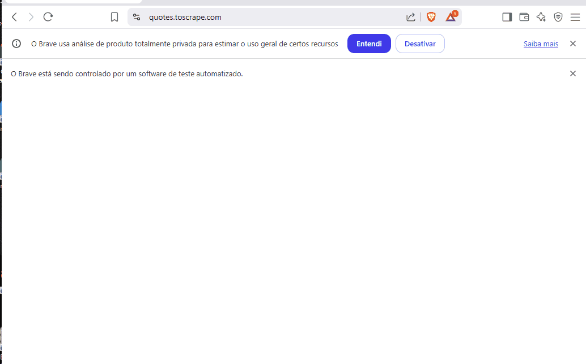

# 🤖 RPA Nível 2 — Scraping com Login, Sessão e Exportação de Dados

Este projeto simula uma automação RPA com Python + Selenium que acessa o site [quotes.toscrape.com](https://quotes.toscrape.com), realiza o login, navega por todas as páginas de citações e exporta os dados para um arquivo CSV.

---

## 🚀 Funcionalidades

- Login automatizado com usuário e senha
- Navegação por múltiplas páginas
- Extração de dados (autor e citação)
- Exportação para CSV
- Organização do projeto em módulos reutilizáveis

---

## 🧠 Tecnologias utilizadas

- Python 3.12.3
- Selenium WebDriver
- Navegador Brave (baseado no Chromium)
- WebDriver do Chrome
- CSV
- Git

---

## 🗂️ Estrutura do Projeto

```bash
nivel_2_login_scraping/
├── main.py                  # Arquivo principal da automação
├── requirements.txt         # Dependências do projeto
├── README.md                # Este arquivo
├── utils/
│   ├── output/
│   │   └── quotes.csv       # Resultado final da automação


## 🎬 Demonstração do Bot


